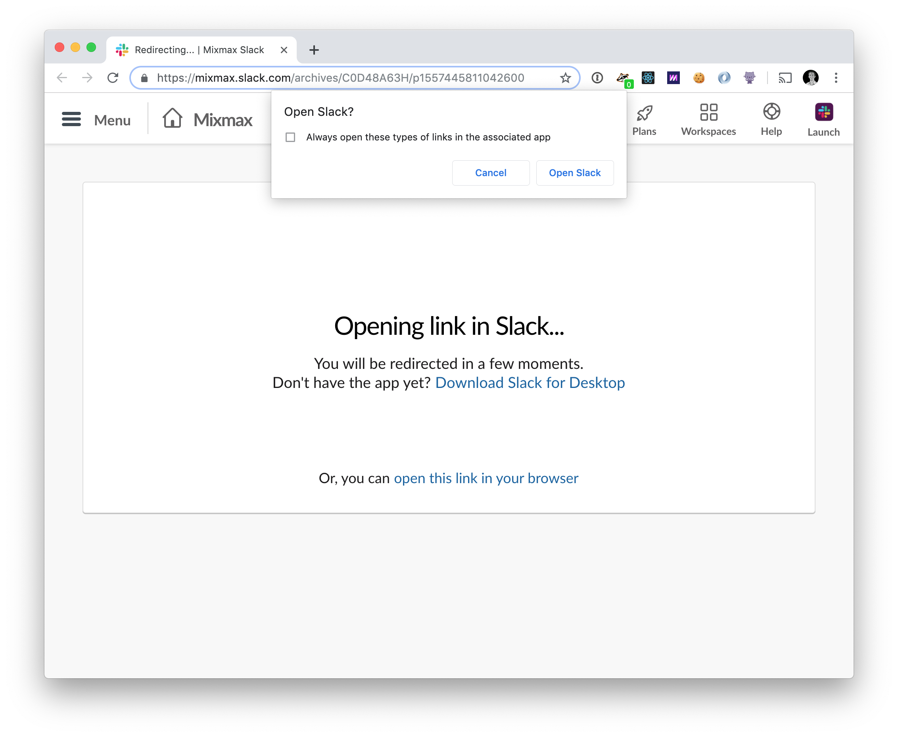

# Force Slack in Browser

Browser tabs are marvelous. They let you save things to read later, they let you read multiple
things simultaneously, we've all known this for [20+ years](https://www.buzzfeednews.com/article/josephbernstein/meet-the-man-who-invented-tabs).

Slack hasn't gotten the memo. When you open an [archive link](https://slackhq.com/advanced-slack-tips-for-geeks)
in your browser, Slack tries to open that link in its desktop app

&mdash;which does not have tabs. We're back to the bad old days of only being able to keep one link
open at a time, and losing your place any time you want to peek at a different link.

Slack doesn't seem terribly interested in fixing this
[for whatever reason](https://twitter.com/enobayram/status/1097382305931452416). Luckily, we can do
it in a [single line of JavaScript](src/app.js).

Now, any time you visit an archive link, you'll be automatically redirected to the message in your
browser.

## Install

https://chrome.google.com/webstore/detail/force-slack-in-browser/gfggogadjpapemlonlgpbofdeefkjakf

## Contributing

PRs and bug reports are welcome!

### Local Development

1. Go to <chrome://extensions>
2. Check the "Developer mode" option in the upper right corner
3. Click *Load Unpacked Extension* and select this folder

If you make changes `src/app.js`, you need to reload the extension which you can do by Cmd-R
reloading <chrome://extensions>. Then you need to reload the archive link you're testing.
